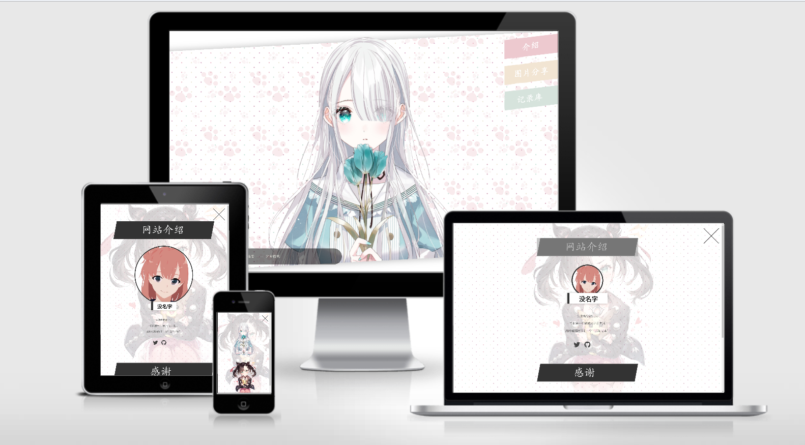
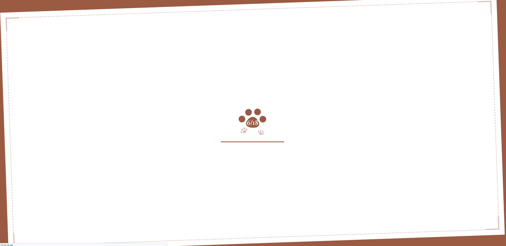
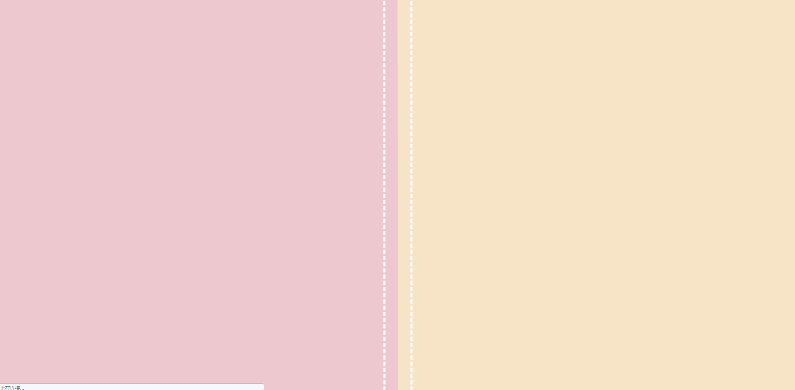
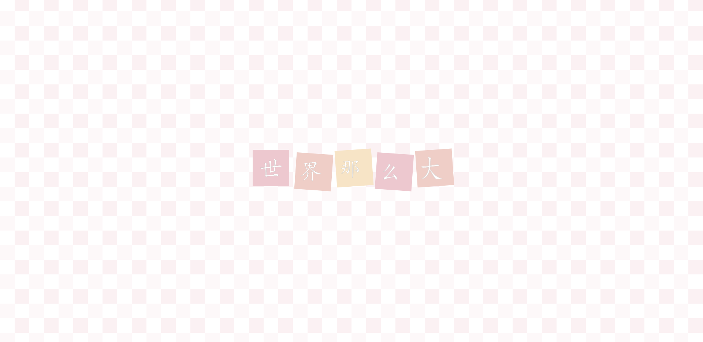
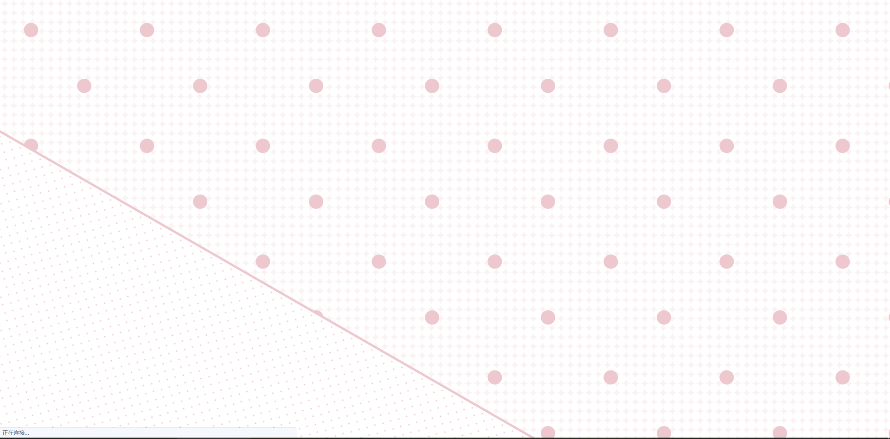
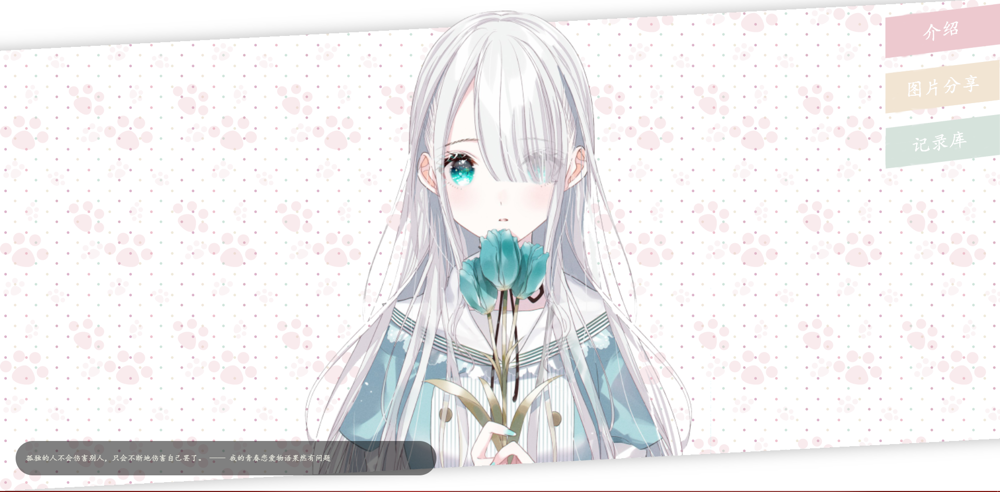

# yui-改
原本是 yui540 的一个css动画项目
第一次看着很美观就 **加以利用** 改成一个 可用的网站



## 动画预览






## 环境
由于是基于 `vue` 所以 需先安装 `Nodejs` 环境
`Nodejs` 搭建好了后还需要安装 `vue-cli`
```
#进入终端  比如windows10的 `Windows PowerShell`
安装vue-cli：
npm install -g @vue/cli-service-global
	
# 使用 `终端` 进入网站目录
cd 网站目录
	
# 安装依赖包	
npm install     
如果失败则使用
npm install --registry https://registry.npm.taobao.org 
```
一切安装完毕后就可以使用
```
npm start
```
进行预览


### 构建
配置好了后就可以开始 `构建`    
完整文件输出在 `public` 中
```
npm run build 
```
#### 文件结构
`\src\scss\modules\`  css动画         `\src\scss\keyframes\` css动画时间点
pc=pc端  sp=移动端  tablet=平板端    
_developer-page.scss  主页面
_load-view.scss  动画第一阶段
_motion-part1.scss  动画第二阶段
_motion-part2.scss  动画第三阶段
_top-page.scss  动画结束          
其他配置
_gallery-page.scss  _other-page.scss

